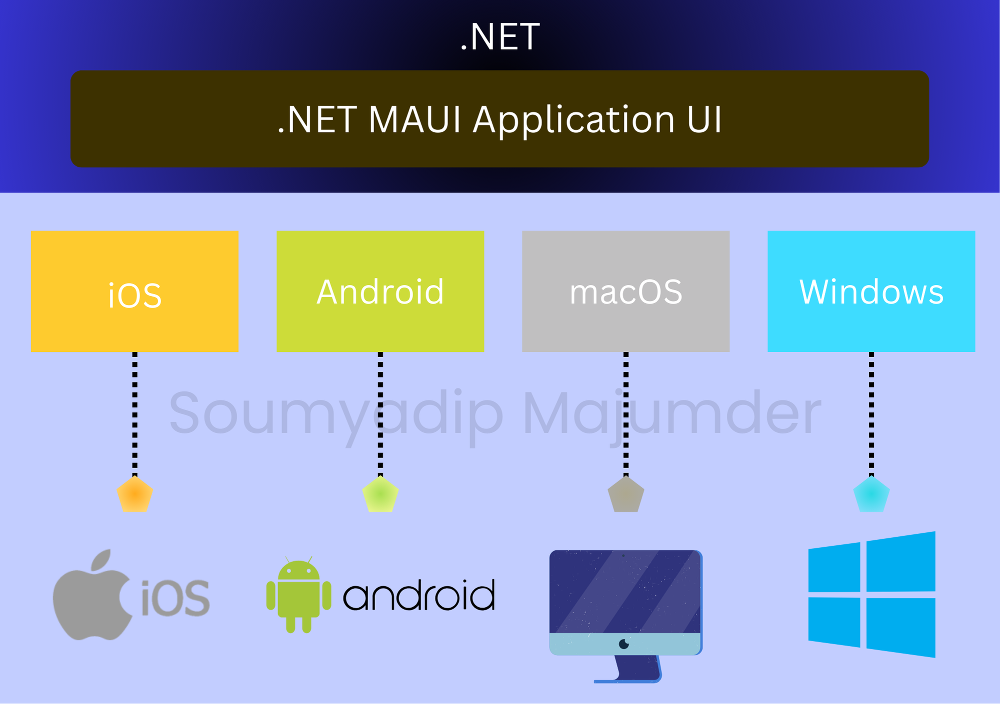

# .NET-MAUI-Gathering
The .NET MAUI (Multi-platform App UI)  a cross-platform framework for delivering native experience mobile and desktop applications with C# in the backend and XAML in the frontend.

### What is .NET MAUI?
The .NET Multi-platform App UI (.NET MAUI) is a framework for building cross-platform applications using C# and XAML. 
It allows developers to create native applications for Android, iOS, macOS, and Windows from a single codebase. 
The .NET MAUI is the evolution of Xamarin.Forms and is part of the .NET ecosystem.

