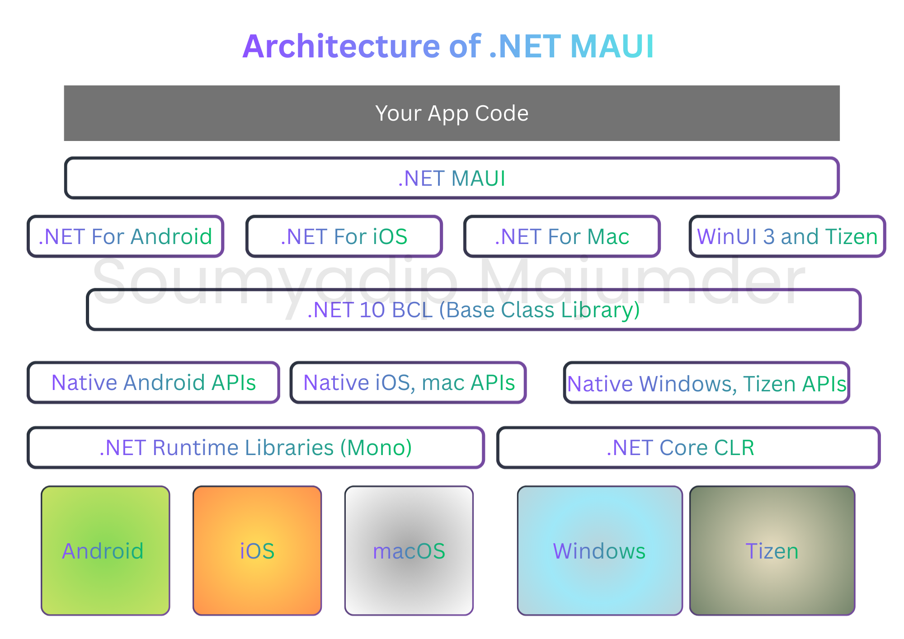

# .NET-MAUI
The .NET MAUI (Multi-platform App UI)  a cross-platform framework for delivering native experience mobile and desktop applications with C# in the backend and XAML in the frontend.

__In this article__
 - [What is .NET MAUI?](#what-is-net-maui)
 - [Who .NET MAUI is For](#who-net-maui-is-for)
 - [How .NET MAUI works](#how-net-maui-works)
 - [What .NET MAUI Offers](#what-net-maui-offers)
 - [Cross-Platform APIs for Device Features](#cross-platform-apis-for-device-features)
 - [Single Project Architecture in .NET MAUI](#single-project-architecture-in-net-maui)
 - [Hot Reload](#hot-reload)

## What is .NET MAUI?
The .NET Multi-platform App UI (.NET MAUI) is a framework for building cross-platform applications using C# and XAML. 
It allows developers to create native applications for Android, iOS, macOS, and Windows from a single codebase. 
The .NET MAUI is the evolution of Xamarin.Forms and is part of the .NET ecosystem.

.NET MAUI represents the next evolution of cross-platform development, building upon the foundation of Xamarin.Forms. 
It is extending its capabilities beyond mobile to include desktop applications. Unlike its predecessor, .NET MAUI introduces 
 a unified project structure, enabling developers to target multiple platforms from a single codebase while still allwoing 
 platform-specific customization when needed. Its UI controls have been completely re-engineered for superor performance and 
 extensibility, ensuring modern, responsive experiences across devices. While developers familiar with Xamarin.Forms will 
 recognizee many concepts, .NET MAUI delivers a streamlined architecture and enhanced flexibility. The core vision behind 
 .NET MAUI is simple: maximize code sharing for both application logic and UI layout, empowering teams to deliver rich, 
 multi-platform applications efficiently and consistently.

 ## Who .NET MAUI is For
 .NET MAUI is designed for developers who aim to:
 - Build cross-platform applications using **XAML** and **C#** whithin a single, shared codebase in **Visual Studio**, **Rider**, **VsCode**. 

 - Maintain a consistent UI layout and design across multiple platforms while allowing for platform-specific customizations.
	
 - Reuse code, unit tests and business logic seamlessly across different operating systems. [_Supported platforms_](supported-platforms.md) docs.

 ## How .NET MAUI works
 With .NET 6 and later versions, Microsoft delivers a unified ecosystem of platform-specific frameworks for building modern 
 applications: .NET for Android, .NET for iOS, .NET for Mac Catalyst, Windows UI 3 (WinUI 3) and Tizen OS. These frameworks 
 share a common foundation - the .NET Base Class Library (BCL) - which abstracts platform-specific details, enabling developers 
 to write consistent, reusable business logic across devices.
 The BCL operates on top of the .NET runtime, which provides the execution environment for your applications. On Android, 
 iOS and macOS, this environment is powered by **Mono (.NET Runtime Libraries)**, a proven  implementation of the .NET runtime. 
 On Windows, Tizen the .NET Common Language Runtime (CLR) takes the lead.

 While the BCL ensures portability for core logic, user interface design remains inherently platform-specific. Each platform 
 offers unique UI paradigms and interaction models. Developers can choose to craft native UIs using the respective 
 frameworks - Android UI Toolkit, iOS UIKit, Mac Catalyst AppKit, WinUI 3 and Tizen NUI - to deliver optimal user experiences. 
 However, this approach often results in maintaining separate codebases for each device family.

 .NET MAUI provides a single framework for building the UIs for mobile and desktop apps. The following diagram 
 illustrates a high-level architecture of a .NET MAUI application:

 

_Architecture-diagram_

 
	*[Source: Microsoft Docs]*

 In a .NET MAUI apps, your code primarily interacts with the .NET MAUI controls and API layer(1), which serves as the 
 abstraction for building cross-platform UIs. This layer communicates directly with the native platform APIs(3), 
 ensuring that your app delivers a truly native experience. When necessary, developers can also invoke 
 platform-specific APIs(2) directly for advanced customization.

 .NET MAUI apps can be developed on Windows or macOS and compiled into native application packages for each target 
 platform.

 - Android: Apps are compiled from C# into Intermediate Language (IL) and then Just-In-Time (JIT) compiled into native ARM or x86 at runtime.

 - iOS: Apps are Ahead-Of-Time (AOT) compiled from C# into native ARM code during the build process, as iOS does not support JIT compilation.

 - macOS: Apps can be either AOT compiled into native ARM or x86 code or run using JIT compilation, depending on the deployment method.

 - Windows: Apps are compiled from C# into Intermediate Language (IL) and then Just-In-Time (JIT) compiled into native x86 or ARM or x64 code at runtime.

 For more details on **WinUI 3**, refer to the official documentation: [WinUI Docs](https://learn.microsoft.com/en-us/windows/apps/winui/).

 `
 **_NOTE:_** Building apps for iOS or macOS, requires a Mac or iOS device (for SDKs).
 `

 ## What .NET MAUI Offers
 .NET Maui delivers a comprehensive set of capabilities to simplify and accelerate cross-platform app development:
 
 - **Rich Control Library**: A wide range of UI controls fro displaying data, initiating actions, indicating activity, managing collections, 
 and selecting input.

 - **Advanced Layout Engine**: Tools for designing responsive and adaptive page layouts.

 - **Multiple Page Types**: Support for diverse navigation patterns, including drawers and tabbed interfaces.

 - **Data Binding**: Enables clean, maintainable and scalable development through MVVM and other patterns.

 - **Customizable Handlers**: Fine-tune how UI elements are rendered and behave across platforms.

 - **Cross-Platform Device APIs**: Access native features like GPS, accelerometer, battery status and network 
connectivity through unified APIs.
	
 - **Graphics and Drawing Support**: A powerful canvas for rendering shapes, images and applying transformations 
and Windows within one project.

 - **Single Project System**: Multi-targeting architecture for Android, iOS, macOS and Windows within one project.
	
 - **.NET Hot Reload**: Instantly apply changes to XAML and C# code while the app runs, without rebuilding for 
faster iteration. [.NET Hot Reload](https://github.com/SoumyadipYT-OSS/.NET-MAUI-Gathering?tab=readme-ov-file#hot-reload).
	
	
 ## Cross-Platform APIs for Device Features
 .NET MAUI provides a unified set of APIs that enable seamless access to native device capabilities across platforms. 
 These APIs simplify development by eliminating the need for platform-specific implementations, Key features include: 

 - **Sensor Integration**: Access device sensors such as accelerometer, gyroscope, compass, and barometer for motion and orientation data.
 - **Network Awareness**: Monitor network connectivity status and respond to changes in real-time.
 - **Device Information**: Retrieve essential device details like model, manufacturer, operating system version, and unique identifiers.
 - **Clipboard Operations**: Copy and paste text and images to and from the system clipboard.
 - **File Selection**: Open native file pickers to select files from the device storage.
 - **Secure Storage**: Store sensitive data securely using platform-specific encryption mechanisms.
 - **Text-to-Speech**: Convert text into spoken words using the device's built-in text-to-speech engine.
 - **Authentication Support**: Implement biometric authentication methods like fingerprint and facial recognition.
 - **Browser Authentication**: Facilitate secure user authentication through external web browsers where the authentication flows that listen for a callback to a specific app registered URL.

 ## Single Project Architecture in .NET MAUI
 The .NET MAUI Single Project model consolidates platform-specific development into a unified, shared project that 
 targets multiple platforms (Android, iOS, macOS, Windows) from a single codebase. This approach delivers a streamlined 
 and consistent cross-platform development experience, eliminating the complexity of managing multiple projects.

 Key features include:
 - **Unified Project Structure**: A single project file (.csproj) that defines all target platforms, dependencies, and configurations.
 - **Simplified Debugging**: Debug and test applications across all platforms from within a single IDE session.
 - **Shared Resources**: Centralized management of assets, styles, and resources for consistent branding and theming.
 - **Single App Manifest**: A unified app manifest that defines permissions, capabilities, and metadata for all target platforms.
 - **Platform-Specific Access**: Conditional compilation and platform-specific code sections within the shared project to handle unique platform requirements.
 - **Common Entry Point**: A single entry point for application startup logic, simplifying initialization and configuration.
 - **Multi-Targetting with SDK-Style Projects**: Leverage SDK-style project files to easily manage dependencies and target multiple platforms with minimal configuration.

 For more details, refer to the official documentation: [Single Project in .NET MAUI](https://learn.microsoft.com/en-us/dotnet/maui/fundamentals/single-project?view=net-maui-10.0).

 ## Hot Reload
 .NET MAUI supports .NET Hot Reload, allowing developers to modify managed source code while the application is running - withoug pausing 
 execution or setting breakpoints. Changes are applied instantly to the running app, elminating the need for a full recomplication and 
 significantly accelerating development cycles. 
 In addition, **XAML Hot Reload** enables real-time updates to the UI layout and design, allowing developers to see changes immediately without restarting the app.
 Navigation state and data are preserved during these updates, ensuring a seamless and efficient workflow for rapid UI iteration without losing context.

