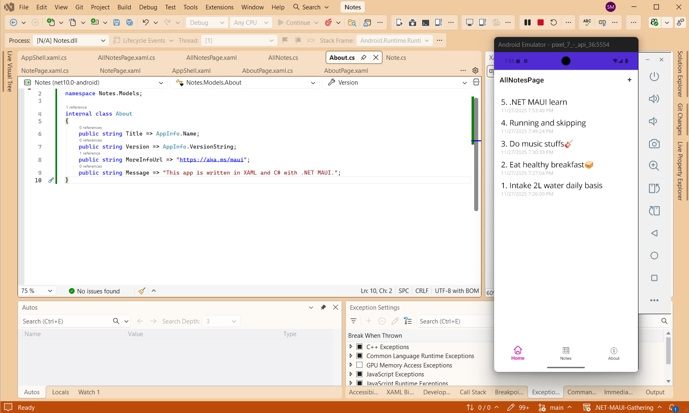
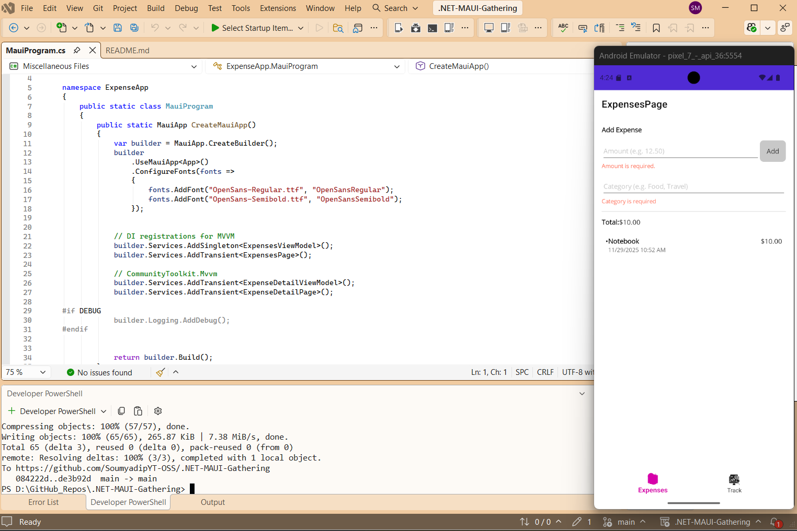
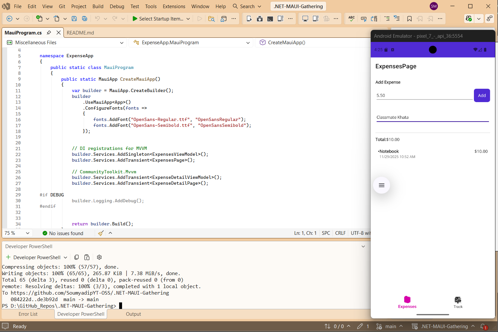
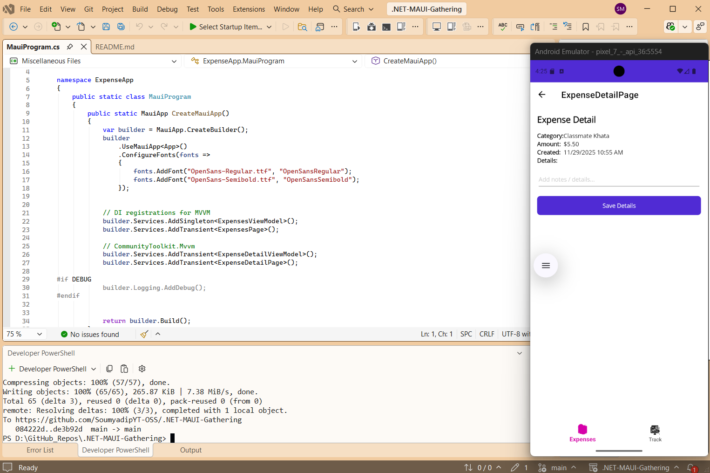

# Tutorials
.NET MAUI App project named 'Notes', the purpose of the application is you can write and store your notes into it.

This directory contains focused .NET MAUI examples:
- Multi-target setup (Android, iOS/macOS, Windows)
- Basic UI composition and resources
- Simple navigation patterns

## Project Output
Screenshot:

# Mvvm Architecture

## _02_MVVM Principles – ExpenseApp (mini project)

A focused .NET MAUI mini project demonstrating MVVM best practices using CommunityToolkit.Mvvm. The sample implements an Expenses tracker with clean separation of Models, ViewModels, and Views, dependency injection for pages and view models, and Shell-based navigation.

Project location: `_02_MVVM Principles/ExpenseApp`

Key features

- Architecture
  - Models, ViewModels, and Views separated into their own folders.
  - DI registers pages and view models so pages receive VMs via constructor injection.
  - A small `IExpenseStore` service demonstrates persistence abstraction.

- ObservableCollection
  - The main expenses list is an `ObservableCollection<Expense>` so the UI updates automatically when items are added, removed, or changed.

- Validation
  - Input validation gates the Add command. Required rules include: `Amount` must be a positive number and `Category` must be provided. Validation errors disable the Add flow and surface messages in the UI.

- Commands
  - Manual `Add` command on the list ViewModel demonstrates imperative command wiring (e.g., `ICommand AddCommand`).
  - The Detail ViewModel uses CommunityToolkit.Mvvm source-generated commands (e.g., `[RelayCommand] SaveAsync`) and properties for concise code.

- Navigation
  - AppShell uses tabs for primary views (Expenses list and Summary).
  - Route-based navigation passes `Expense` objects (or their identifiers) to the detail page; the detail page loads the Expense and exposes edit/save functionality.

- Detail page
  - Loads an `Expense` passed via routing or ID, allows editing of `Details` and saving back to the store.
  - Uses source-generated bindable properties and commands in the detail VM for save/validation behavior.

- Reactive total
  - A `Total` property computes the sum of current expenses reactively (observes collection changes and item property changes) and raises property change notifications so the UI always shows the current total.

  ## Project Output
	Screenshot (Checking Input Validation):
	
	Screenshot (Input value):
	
	Screenshot (Adding the value):
	
