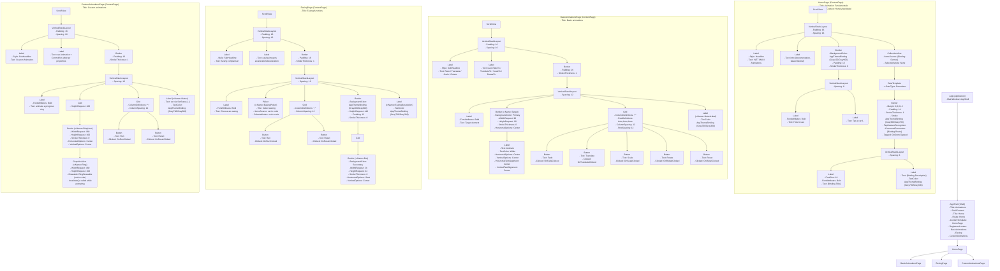

```mermaid
flowchart TB
  App["App (Application)\n- MainWindow: AppShell"] --> Shell

  Shell["AppShell (Shell)\n- Title: Animations\n- ShellContent:\n  - Title: Home\n  - Route: Home\n  - ContentTemplate: HomePage\n- Registered routes:\n  - BasicAnimations\n  - Easing\n  - CustomAnimations"] --> HomePage
  HomePage --> BasicAnimationsPage
  HomePage --> EasingPage
  HomePage --> CustomAnimationsPage

  subgraph HOME["HomePage (ContentPage)\n- Title: Animation Fundamentals\n- BindingContext: HomeViewModel"]
    direction TB
    HOME_Scroll["ScrollView"] --> HOME_Root["VerticalStackLayout\n- Padding: 16\n- Spacing: 16"]
    HOME_Root --> HOME_Title["Label\n- Style: Headline\n- Text: .NET MAUI Animations"]
    HOME_Root --> HOME_Intro["Label\n- Text: intro (documentation-based tutorial)"]
    HOME_Root --> HOME_HowToBorder["Border\n- BackgroundColor: AppThemeBinding (Gray100/Gray900)\n- Padding: 12\n- StrokeThickness: 0"]
    HOME_HowToBorder --> HOME_HowToStack["VerticalStackLayout\n- Spacing: 8"]
    HOME_HowToStack --> HOME_HowToTitle["Label\n- FontAttributes: Bold\n- Text: How to use"]
    HOME_HowToStack --> HOME_HowToText["Label\n- Text: Tap a card..."]
    HOME_Root --> HOME_List["CollectionView\n- ItemsSource: {Binding Demos}\n- SelectionMode: None"]
    HOME_List --> HOME_Template["DataTemplate\n- x:DataType: DemoItem"]
    HOME_Template --> HOME_Card["Border\n- Margin: 0,0,0,12\n- Padding: 14\n- StrokeThickness: 1\n- Stroke: AppThemeBinding (Gray300/Gray700)\n- TapGestureRecognizer:\n  - CommandParameter: {Binding Route}\n  - Tapped: OnDemoTapped"]
    HOME_Card --> HOME_CardStack["VerticalStackLayout\n- Spacing: 6"]
    HOME_CardStack --> HOME_CardTitle["Label\n- FontSize: 18\n- FontAttributes: Bold\n- Text: {Binding Title}"]
    HOME_CardStack --> HOME_CardDesc["Label\n- Text: {Binding Description}\n- TextColor: AppThemeBinding (Gray700/Gray300)"]
  end

  subgraph BASIC["BasicAnimationsPage (ContentPage)\n- Title: Basic animations"]
    direction TB
    BASIC_Scroll["ScrollView"] --> BASIC_Root["VerticalStackLayout\n- Padding: 16\n- Spacing: 16"]
    BASIC_Root --> BASIC_Header["Label\n- Style: SubHeadline\n- Text: Fade / Translate / Scale / Rotate"]
    BASIC_Root --> BASIC_Desc["Label\n- Text: uses FadeTo / TranslateTo / ScaleTo / RotateTo"]
    BASIC_Root --> BASIC_DemoBorder["Border\n- Padding: 16\n- StrokeThickness: 1"]
    BASIC_DemoBorder --> BASIC_DemoStack["VerticalStackLayout\n- Spacing: 12"]
    BASIC_DemoStack --> BASIC_TargetTitle["Label\n- FontAttributes: Bold\n- Text: Target element"]
    BASIC_DemoStack --> BASIC_Target["Border (x:Name=Target)\n- BackgroundColor: Primary\n- WidthRequest: 90\n- HeightRequest: 90\n- StrokeThickness: 0\n- HorizontalOptions: Center"]
    BASIC_Target --> BASIC_TargetLabel["Label\n- Text: Animate\n- TextColor: White\n- HorizontalOptions: Center\n- VerticalOptions: Center\n- HorizontalTextAlignment: Center\n- VerticalTextAlignment: Center"]
    BASIC_DemoStack --> BASIC_Buttons["Grid\n- ColumnDefinitions: *,*\n- RowDefinitions: Auto,Auto,Auto\n- ColumnSpacing: 12\n- RowSpacing: 12"]
    BASIC_Buttons --> BASIC_Fade["Button\n- Text: Fade\n- Clicked: OnFadeClicked"]
    BASIC_Buttons --> BASIC_Translate["Button\n- Text: Translate\n- Clicked: OnTranslateClicked"]
    BASIC_Buttons --> BASIC_Scale["Button\n- Text: Scale\n- Clicked: OnScaleClicked"]
    BASIC_Buttons --> BASIC_Rotate["Button\n- Text: Rotate\n- Clicked: OnRotateClicked"]
    BASIC_Buttons --> BASIC_Reset["Button\n- Text: Reset\n- Clicked: OnResetClicked"]
    BASIC_DemoStack --> BASIC_Status["Label (x:Name=StatusLabel)\n- TextColor: AppThemeBinding (Gray700/Gray300)"]
  end

  subgraph EASING["EasingPage (ContentPage)\n- Title: Easing functions"]
    direction TB
    EASING_Scroll["ScrollView"] --> EASING_Root["VerticalStackLayout\n- Padding: 16\n- Spacing: 16"]
    EASING_Root --> EASING_Header["Label\n- Style: SubHeadline\n- Text: Easing comparison"]
    EASING_Root --> EASING_Desc["Label\n- Text: easing impacts acceleration/deceleration"]
    EASING_Root --> EASING_DemoBorder["Border\n- Padding: 16\n- StrokeThickness: 1"]
    EASING_DemoBorder --> EASING_Stack["VerticalStackLayout\n- Spacing: 12"]
    EASING_Stack --> EASING_Title["Label\n- FontAttributes: Bold\n- Text: Choose an easing"]
    EASING_Stack --> EASING_Picker["Picker (x:Name=EasingPicker)\n- Title: Select easing\n- ItemsSource: set in code\n- SelectedIndex: set in code"]
    EASING_Stack --> EASING_ButtonGrid["Grid\n- ColumnDefinitions: *,*\n- ColumnSpacing: 12"]
    EASING_ButtonGrid --> EASING_Run["Button\n- Text: Run\n- Clicked: OnRunClicked"]
    EASING_ButtonGrid --> EASING_Reset["Button\n- Text: Reset\n- Clicked: OnResetClicked"]
    EASING_Stack --> EASING_Track["Border\n- BackgroundColor: AppThemeBinding (Gray200/Gray800)\n- HeightRequest: 140\n- Padding: 12\n- StrokeThickness: 0"]
    EASING_Track --> EASING_TrackGrid["Grid"]
    EASING_TrackGrid --> EASING_Dot["Border (x:Name=Dot)\n- BackgroundColor: Secondary\n- WidthRequest: 24\n- HeightRequest: 24\n- StrokeThickness: 0\n- HorizontalOptions: Start\n- VerticalOptions: Center"]
    EASING_Stack --> EASING_Label["Label (x:Name=EasingDescription)\n- TextColor: AppThemeBinding (Gray700/Gray300)"]
  end

  subgraph CUSTOM["CustomAnimationsPage (ContentPage)\n- Title: Custom animations"]
    direction TB
    CUSTOM_Scroll["ScrollView"] --> CUSTOM_Root["VerticalStackLayout\n- Padding: 16\n- Spacing: 16"]
    CUSTOM_Root --> CUSTOM_Header["Label\n- Style: SubHeadline\n- Text: Custom Animation"]
    CUSTOM_Root --> CUSTOM_Desc["Label\n- Text: use Animation + Commit for arbitrary properties"]
    CUSTOM_Root --> CUSTOM_DemoBorder["Border\n- Padding: 16\n- StrokeThickness: 1"]
    CUSTOM_DemoBorder --> CUSTOM_Stack["VerticalStackLayout\n- Spacing: 12"]
    CUSTOM_Stack --> CUSTOM_Title["Label\n- FontAttributes: Bold\n- Text: animate a progress ring"]
    CUSTOM_Stack --> CUSTOM_RingGrid["Grid\n- HeightRequest: 180"]
    CUSTOM_RingGrid --> CUSTOM_RingHost["Border (x:Name=RingHost)\n- WidthRequest: 160\n- HeightRequest: 160\n- StrokeThickness: 0\n- HorizontalOptions: Center\n- VerticalOptions: Center"]
    CUSTOM_RingHost --> CUSTOM_Ring["GraphicsView (x:Name=Ring)\n- WidthRequest: 160\n- HeightRequest: 160\n- Drawable: RingDrawable (set in code)\n- Invalidate(): called while animating"]
    CUSTOM_Stack --> CUSTOM_ButtonGrid["Grid\n- ColumnDefinitions: *,*\n- ColumnSpacing: 12"]
    CUSTOM_ButtonGrid --> CUSTOM_Run["Button\n- Text: Run\n- Clicked: OnRunClicked"]
    CUSTOM_ButtonGrid --> CUSTOM_Reset["Button\n- Text: Reset\n- Clicked: OnResetClicked"]
    CUSTOM_Stack --> CUSTOM_Status["Label (x:Name=Status)\n- Text: set via SetStatus(...)\n- TextColor: AppThemeBinding (Gray700/Gray300)"]
  end
```
