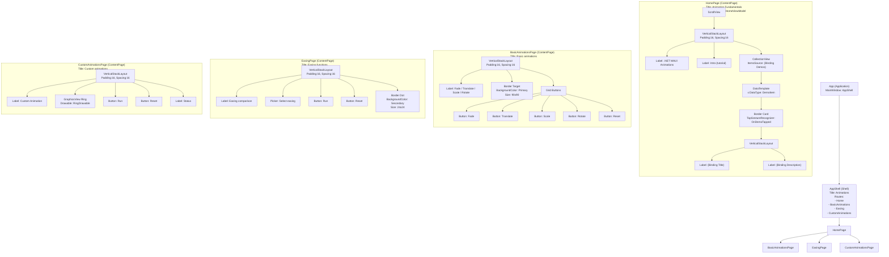

```mermaid
flowchart TB
  App[" App (Application)\nMainWindow: AppShell"] --> Shell

  Shell[" AppShell (Shell)\nTitle: Animations\nRoutes:\n- Home\n- BasicAnimations\n- Easing\n- CustomAnimations"] --> HomePage
  HomePage --> BasicAnimationsPage
  HomePage --> EasingPage
  HomePage --> CustomAnimationsPage

  subgraph HOME[" HomePage (ContentPage)\nTitle: Animation Fundamentals\nBindingContext: HomeViewModel"]
    direction TB
    HOME_Scroll["ScrollView"] --> HOME_Root["VerticalStackLayout\nPadding:16, Spacing:16"]
    HOME_Root --> HOME_Title["Label: .NET MAUI Animations"]
    HOME_Root --> HOME_Intro["Label: Intro (tutorial)"]
    HOME_Root --> HOME_List["CollectionView\nItemsSource: {Binding Demos}"]
    HOME_List --> HOME_Template["DataTemplate\nx:DataType: DemoItem"]
    HOME_Template --> HOME_Card["Border Card\nTapGestureRecognizer: OnDemoTapped"]
    HOME_Card --> HOME_CardStack["VerticalStackLayout"]
    HOME_CardStack --> HOME_CardTitle["Label: {Binding Title}"]
    HOME_CardStack --> HOME_CardDesc["Label: {Binding Description}"]
  end

  subgraph BASIC[" BasicAnimationsPage (ContentPage)\nTitle: Basic animations"]
    direction TB
    BASIC_Root["VerticalStackLayout\nPadding:16, Spacing:16"]
    BASIC_Root --> BASIC_Header["Label: Fade / Translate / Scale / Rotate"]
    BASIC_Root --> BASIC_Target["Border Target\nBackgroundColor: Primary\nSize: 90x90"]
    BASIC_Root --> BASIC_Buttons["Grid Buttons"]
    BASIC_Buttons --> BASIC_Fade["Button: Fade"]
    BASIC_Buttons --> BASIC_Translate["Button: Translate"]
    BASIC_Buttons --> BASIC_Scale["Button: Scale"]
    BASIC_Buttons --> BASIC_Rotate["Button: Rotate"]
    BASIC_Buttons --> BASIC_Reset["Button: Reset"]
  end

  subgraph EASING[" EasingPage (ContentPage)\nTitle: Easing functions"]
    direction TB
    EASING_Root["VerticalStackLayout\nPadding:16, Spacing:16"]
    EASING_Root --> EASING_Header["Label: Easing comparison"]
    EASING_Root --> EASING_Picker["Picker: Select easing"]
    EASING_Root --> EASING_Run["Button: Run"]
    EASING_Root --> EASING_Reset["Button: Reset"]
    EASING_Root --> EASING_Dot["Border Dot\nBackgroundColor: Secondary\nSize: 24x24"]
  end

  subgraph CUSTOM[" CustomAnimationsPage (ContentPage)\nTitle: Custom animations"]
    direction TB
    CUSTOM_Root["VerticalStackLayout\nPadding:16, Spacing:16"]
    CUSTOM_Root --> CUSTOM_Header["Label: Custom Animation"]
    CUSTOM_Root --> CUSTOM_Ring["GraphicsView Ring\nDrawable: RingDrawable"]
    CUSTOM_Root --> CUSTOM_Run["Button: Run"]
    CUSTOM_Root --> CUSTOM_Reset["Button: Reset"]
    CUSTOM_Root --> CUSTOM_Status["Label: Status"]
  end


```
